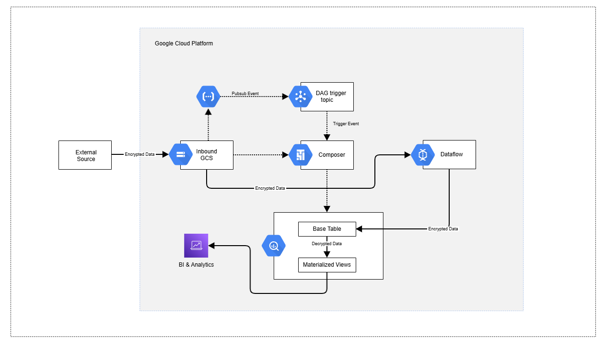

# GCP Data Pipeline Prototype

This project is a prototype of a data pipeline for ingesting, processing, and exposing customer transaction data for analytical use on Google Cloud Platform (GCP).

## 1. Architecture Overview

The data pipeline is designed to be scalable, secure, and aligned with modern data engineering best practices.



**Data Flow:**

1.  **Ingestion**: Transaction data is transfered to the inbound Google cloud storage bucket, notification with file name will be send to the notification pubsub topic.
2.  **Orchestration & Processing**: **Cloud Composer** orchestrates the data processing workflow. It triggers when the notification event arrives at the topic and triggers an Apache beam Dataflow job which ingest the data to the Bigquery Base table.
3.  **Storage**:
    *   **Cloud Storage** acts as a data lake for raw, unprocessed data.
    *   **BigQuery** is used as the data warehouse for raw, staging, and processed analytical tables.
4.  **Querying**: Processed data in BigQuery is exposed to BI tools like Looker or other analytics platforms for reporting and visualization.

## 2. Data Modelling

The BigQuery schema is designed to efficiently answer key business questions.

### Base Tables

**`customers`**

| Field Name | Data Type | Description |
| :--- | :--- | :--- |
| `customer_id` | `STRING` | Unique identifier for each customer. |
| `first_name` | `STRING` | First name of the customer. |
| `last_name` | `STRING` | Last name of the customer. |
| `email` | `STRING` | Email address of the customer. |
| `is_valid` | `BOOLEAN` | A flag to understand if the record is valid or not. |
| `registration_date` | `DATE` | Registration Date. |
| `ingestion_timestamp` | `TIMESTAMP` | Inserted Datetime. |

**`transactions`**

| Field Name | Data Type | Description |
| :--- | :--- | :--- |
| `transaction_id` | `STRING` | Unique identifier for each transaction. |
| `customer_id` | `STRING` | Foreign key to the `customers` table. |
| `transaction_timestamp` | `TIMESTAMP` | Timestamp of the transaction. |
| `amount` | `NUMERIC` | The transaction amount. |
| `is_valid` | `BOOLEAN` | A flag to understand if the record is valid or not. |
| `ingestion_timestamp` | `TIMESTAMP` | Inserted Datetime |

### Analytical Views/Materialized Views

To address the business requirements, we will create a materialized view.

**`customer_monthly_spend` (Materialized View)**

This materialized view will pre-calculate monthly spend metrics for each customer.

```sql
CREATE MATERIALIZED VIEW project.dataset.customer_monthly_spend
PARTITION BY DATE_TRUNC(month, PARSE_DATE('%Y-%m', month))
CLUSTER BY customer_id
AS
SELECT
  customer_id,
  FORMAT_DATE('%Y-%m', DATE(transaction_date)) AS month,
  SUM(amount) AS total_spend,
  AVG(amount) AS average_spend,
  COUNT(transaction_id) AS transaction_count
FROM
  project.dataset.transactions
GROUP BY
  1, 2;
```

**Query Performance and Cost Optimization:**

*   **Partitioning**: The materialized view is partitioned by `month` to allow for efficient time-based queries.
*   **Clustering**: The view is clustered by `customer_id` to co-locate data for the same customer, which speeds up queries that filter or aggregate by customer.

## 3. Coding and Implementation

### Data Ingestion & Storage

1.  **Create CSV files**:
    *   `customers.csv`:
        ```csv
        customer_id,first_name,last_name,email,registration_date
        1,John,Doe,john.doe@example.com,2025-10-15
        2,Jane,Smith,jane.smith@example.com,2025-10-20
        3,Peter,Jones,peter.jones@example.com,2025-09-10
        4,,Jones,peter.jones@example.com,2025-03-10

        ```
    *   `transactions.csv`:
        ```csv
        transaction_id,customer_id,amount,transaction_timestamp
        txn001,1,100.50,2025-10-20T10:00:00Z
        txn002,2,75.25,2023-10-25T14:30:00Z
        txn003,3,50.00,2023-10-12T11:45:00Z

        ```
2.  **Upload to GCS**: Upload these CSV files to a GCS bucket.
3.  **Pipeline**: A Cloud Composer DAG will be configured to:
    *   Load the CSV data from GCS into raw BigQuery tables.
    *   Execute dbt models for transformation.
    *   **Schema Validation**: Basic cleansing will be handled in the dbt models (e.g., casting data types, handling nulls with `COALESCE`).

### Transformations with Java and Apache Beam

For more complex, large-scale transformations, you can use **Apache Beam** with the Java SDK. A Beam pipeline can be executed on Dataflow and integrated into the Cloud Composer workflow.

Example `pom.xml` for a Java Beam project:
```xml
<dependencies>
  <dependency>
    <groupId>org.apache.beam</groupId>
    <artifactId>beam-sdks-java-core</artifactId>
    <version>2.51.0</version>
  </dependency>
  <dependency>
    <groupId>org.apache.beam</groupId>
    <artifactId>beam-runners-google-cloud-dataflow-java</artifactId>
    <version>2.51.0</version>
  </dependency>
</dependencies>
```

### Schema Evolution and Late-Arriving Data

Need to Update

### Infrastructure as Code (IaC) with Terraform

Terraform is used to define and manage the GCP infrastructure.

**`main.tf`**
```terraform
provider "google" {
  project = "your-gcp-project-id"
  region  = "us-central1"
}

resource "google_storage_bucket" "data_lake" {
  name     = "customer-transactions-data-lake"
  location = "US"
}

resource "google_bigquery_dataset" "analytics" {
  dataset_id = "customer_analytics"
  location   = "US"
}

# IAM roles would be defined here
```

### Version Control

The entire project, including Terraform scripts, dbt models, and any other code, will be stored in a Git repository.

### Continuous Integration (CI)

A simple CI pipeline using **GitHub Actions** will be set up to run tests on every push to the main branch.

**`.github/workflows/ci.yml`**
```yaml
name: CI

on: [push]

jobs:
  test:
    runs-on: ubuntu-latest
    steps:
    - uses: actions/checkout@v3
    - name: Set up dbt
      # Steps to install and configure dbt
    - name: Run dbt tests
      run: dbt test
```

## 4. Setup Instructions

1.  **GCP Permissions**: Ensure your GCP user or service account has the following roles:
    *   `roles/bigquery.admin`
    *   `roles/storage.admin`
    *   `roles/composer.admin`
    *   `roles/iam.serviceAccountUser`
2.  **Terraform**:
    *   Install Terraform.
    *   Run `terraform init`.
    *   Run `terraform plan` to review the infrastructure changes.
    *   Run `terraform apply` to create the resources.
3.  **Running the Pipeline**:
    *   Upload the `customers.csv` and `transactions.csv` files to the newly created GCS bucket.

## 5. Commands
```bash
  mvn compile exec:java  -Dexec.mainClass=org.example.DataIngestionPipeline  -Dexec.args="--project=totemic-inquiry-475408-u0 --inputFile=gs://data_bucket_ing_1990/inbound/customer/customer.csv  --outputTable=totemic-inquiry-475408-u0.transaction_analytics.customers_raw --dataType=customer --runner=DataflowRunner --region=europe-west2 --workerMachineType=n2-standard-2 --gcpTempLocation=gs://data_bucket_ing_1990/df-job/"
  mvn compile exec:java  -Dexec.mainClass=org.example.DataIngestionPipeline  -Dexec.args="--project=totemic-inquiry-475408-u0 --inputFile=gs://data_bucket_ing_1990/inbound/transactions/transaction.csv  --outputTable=totemic-inquiry-475408-u0.transaction_analytics.transactions_raw --dataType=transaction --runner=DataflowRunner --region=europe-west2 --workerMachineType=n2-standard-2 --gcpTempLocation=gs://data_bucket_ing_1990/df-job/"
```
## 6. Assumptions

*   The transaction data volume is expected to grow, hence the choice of scalable services like BigQuery and Dataflow.
*   The source data format is CSV, but the pipeline can be adapted for other formats like JSON or Avro.
*   Business users are comfortable with SQL for querying the data in BigQuery.
